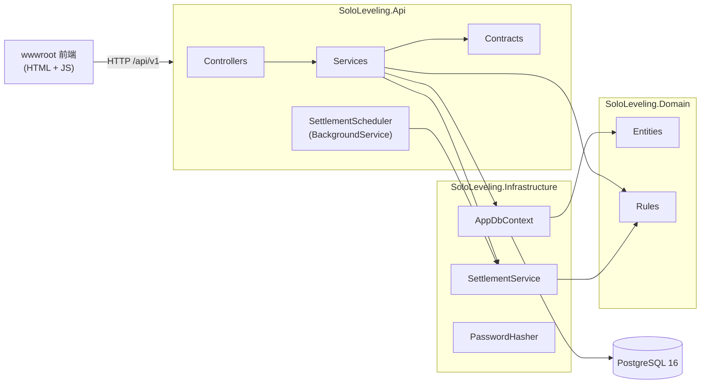

# SoloLeveling 架構說明

本文說明程式碼怎麼組織、一個請求怎麼流動、資料怎麼存。產品規則以 [SPEC.md](SPEC.md) 為準，啟動方式與環境變數見 [README.md](../README.md)。

## 1. 分層與依賴



- 專案參照：Api → Infrastructure → Domain，Domain 不參照任何框架套件。
- Domain 的規則全是 static 方法，只改記憶體中的實體並回傳要新增的資料（`XpEvent`、`DailyLog`），不碰 DB。
- 交易、列鎖、持久化都在 Infrastructure／Api；Api 服務層負責「開交易 → 結算 → 套規則 → 存檔 → commit」的編排。

## 2. 目錄與關鍵類別

### SoloLeveling.Domain

| 路徑 | 內容 |
| --- | --- |
| `Entities/User.cs` | 帳號：Email、PasswordHash、DisplayName、TimeZoneId（IANA） |
| `Entities/Player.cs` | 遊戲化狀態（以 UserId 為主鍵）：Level、Xp、五維屬性、HardMode、Streak、BestStreak、TotalCompleted、LastSettledDate；`AddStat` 增減屬性且最低 0 |
| `Entities/Program.cs` | 66 天週期：StartDate、Cycle、LengthDays（`DefaultLengthDays = 66`）、IsActive |
| `Entities/Quest.cs` | 任務定義：StatType、Difficulty、QuestType、TargetValue、Step、Unit、SortOrder、IsArchived／ArchivedAt |
| `Entities/DailyLog.cs` | 某人某天的快照：CompletionRatio、IsCleared、BonusGranted、Note、IsSettled／SettledAt、`Progresses` 導覽集合 |
| `Entities/QuestProgress.cs` | 某天某任務的進度：Value、IsDone、XpGranted、StatGranted |
| `Entities/XpEvent.cs` | EXP 流水：Amount（可負）、Source、RefId、OccurredAt、Seq |
| `Enums.cs` | `StatType`、`Difficulty`、`QuestType`、`XpSource` |
| `DefaultQuests.cs` | 註冊時建立的 9 個預設任務 |
| `DomainValidationException.cs` | 規則層輸入不合法，API 對應 400 |
| `Rules/Leveling.cs` | `XpNeeded`、`GainXp`（連續升級）、`LoseXp`（撤銷，可降級）、`ApplyPenalty`（不降級）、`RankOf` |
| `Rules/CompletionRules.cs` | `IsDone`、`RewardOf`、`ThresholdOf`、`CompletionRatio`（四捨五入到 4 位）、`PenaltyOf`、`DailyBonusXp` 等常數 |
| `Rules/ProgressUpdater.cs` | `SetValue`（寫進度＋發／收回任務獎勵）、`Recalculate`（重算達標率與達標獎勵）、`ClearQuestProgress`（改任務類型時清除今日進度） |
| `Rules/Settlement.cs` | `Settle`：結算演算法的純規則部分，回傳 `SettlementResult(Today, TodayLog, NewLogs, Events)`；常數 `MaxCatchUpDays = 400`、`MaxPenaltiesPerSettlement = 3` |
| `Rules/UserClock.cs` | `DateOf(utc, timeZoneId)`：全專案唯一決定「今日」的地方 |

### SoloLeveling.Infrastructure

| 路徑 | 內容 |
| --- | --- |
| `AppDbContext.cs` | DbSet、主鍵／唯一鍵／索引、欄位長度與精度、enum 存字串、`DateTimeOffset` ↔ Unix 毫秒的全域 converter |
| `SettlementService.cs` | `SettleAsync(userId, ct)`：`SELECT … FOR UPDATE` 鎖 Player 列、載入待結算區間的 DailyLog、呼叫 `Settlement.Settle`、存檔；呼叫端已有交易就沿用，沒有才自己開 |
| `PasswordHasher.cs` | PBKDF2-SHA256 的 `Hash`／`Verify` |
| `Migrations/` | EF Core migration（`InitialCreate`） |

### SoloLeveling.Api

| 路徑 | 內容 |
| --- | --- |
| `Program.cs` | DI 註冊、Options 驗證、JWT、JSON converter、統一錯誤格式、啟動時 migrate、中介軟體順序 |
| `AppOptions.cs` | `DatabaseConnectionString`、`JwtSecret`（`[Required]`，JwtSecret `[MinLength(32)]`） |
| `Controllers/AuthController.cs` | `POST /auth/register`、`POST /auth/login`（不需驗證） |
| `Controllers/MeController.cs` | `GET /me`、`PATCH /me` |
| `Controllers/QuestsController.cs` | `GET/POST /quests`、`PUT /quests/reorder`、`PUT/DELETE /quests/{id}` |
| `Controllers/TodayController.cs` | `GET /today`、`PUT /today/quests/{id}/progress`、`PUT /today/note` |
| `Controllers/HistoryController.cs` | `GET /history`、`GET /xp-events` |
| `Controllers/ProgramController.cs` | `POST /program/restart` |
| `Services/TodayContextLoader.cs` | `LoadAsync`：先結算，再載入 User、Player、今日 DailyLog（含 Progresses）、未封存任務，回傳 `TodayContext` |
| `Services/AccountService.cs` | 註冊（建立 User、Player、第 1 週期、9 個預設任務）、登入、`ValidateTimeZone` |
| `Services/PlayerService.cs` | `/me` 查詢與更新；切換困難模式時呼叫 `ProgressUpdater.Recalculate` |
| `Services/QuestService.cs` | 任務 CRUD 與排序；新增／修改／封存後重算今日達標 |
| `Services/TodayService.cs` | 今日查詢、進度寫入、反思筆記；`Build` 組 `TodayResponse` |
| `Services/HistoryService.cs` | 每日紀錄（區間 ≤ 100 天）與 EXP 流水（limit 夾在 1–200） |
| `Services/ProgramService.cs` | 開新 66 天週期 |
| `Services/SettlementScheduler.cs` | `BackgroundService`，啟動時跑一次、之後每小時 `RunOnceAsync` |
| `Contracts/Dtos.cs`、`Contracts/TodayDtos.cs` | 請求／回應 record |
| `Contracts/Mappers.cs` | 實體轉 DTO（`ToDto`）、`ToUnixSeconds`（唯一的秒換算處） |
| `Contracts/StatTypeJsonConverter.cs` | `StatType` ↔ `STR/VIT/INT/WIL/SPI` |
| `Errors/ApiErrorException.cs` | 帶狀態碼與錯誤代碼的例外，含 `BadRequest／Unauthorized／NotFound／Conflict` 工廠方法 |
| `Errors/ErrorHandlingMiddleware.cs` | 把 `ApiErrorException`、`DomainValidationException` 轉成 `{ error: { code, message } }` |
| `Auth/JwtTokenService.cs` | 簽發 JWT |
| `Auth/CurrentUserExtensions.cs` | `User.GetUserId()` 取 `sub` claim |
| `wwwroot/` | `index.html`、`app.js`、`app.css` |

## 3. 請求生命週期：PUT /api/v1/today/quests/{id}/progress

1. **驗證與路由**：JwtBearer 驗 token，`TodayController.SetProgress` 以 `User.GetUserId()` 取得使用者 ID，把 `ProgressRequest.Value` 交給 `TodayService.SetProgressAsync`。
2. **開交易**：`db.Database.BeginTransactionAsync`。
3. **結算與載入**：`TodayContextLoader.LoadAsync` → `SettlementService.SettleAsync`：
   - 偵測到已有交易，不另開。
   - `SELECT * FROM "Players" WHERE "UserId" = … FOR UPDATE` 鎖住 Player 列；同一使用者的其他請求在此排隊。
   - 以 `UserClock.DateOf(now, user.TimeZoneId)` 算出今日，載入待結算區間到今日的 DailyLog。
   - `Settlement.Settle` 逐日結算到昨日，並確保今日的 DailyLog 存在；新紀錄與懲罰事件 `AddRange` 後 `SaveChangesAsync`（仍在交易內，不 commit）。
4. **載入今日內容**：loader 取 User、Player（已被追蹤的同一個實體）、今日 DailyLog 的 QuestProgress（EF 自動掛回 `Progresses`）、未封存任務（依 SortOrder）。
5. **找任務**：不在 `ActiveQuests` 裡就丟 `ApiErrorException.NotFound("QuestNotFound", …)`，交易隨 `await using` 釋放而回滾。
6. **套規則**：先記下既有進度的 Id，再呼叫 `ProgressUpdater.SetValue`：
   - 驗證值（Check 只能 0／1，Count／Limit 不可為負，否則丟 `DomainValidationException`）。
   - 沒有進度就新建 `QuestProgress` 並加入 `log.Progresses`。
   - 依完成狀態變化發放或撤銷 EXP、屬性、TotalCompleted，產生 `Quest`／`QuestUndo` 事件。
   - `Recalculate` 重算達標率與 IsCleared，必要時產生 `DailyBonus`／`DailyBonusUndo` 事件，並更新 BestStreak。
7. **持久化**：把新進度明確 `db.QuestProgresses.AddRange`（避免被當成 Modified），事件 `db.XpEvents.AddRange`，`SaveChangesAsync`。
8. **Commit**：`tx.CommitAsync`，釋放 Player 列鎖。
9. **組回應**：`Build(context)` 依未封存任務產生 `TodayQuestDto`（含 value、isDone、xpReward、statReward），加上今日的 completionRatio、isCleared、threshold、bonusGranted、note。

## 4. 結算

規則細節見 [SPEC.md 第 7 節](SPEC.md#7-結算演算法)，此處只列實作重點。

**觸發時機**

- 所有需要「今日」的端點：`GET/PATCH /me`、`POST/PUT/DELETE /quests`、`GET /today` 系列、`GET /history`、`POST /program/restart`，都經 `TodayContextLoader.LoadAsync` 先結算。
- 不結算的端點：`GET /quests`、`PUT /quests/reorder`、`GET /xp-events`、auth。
- `SettlementScheduler`：啟動時跑一次、之後每小時一次；撈出所有使用者後在記憶體篩選 `LastSettledDate is null || LastSettledDate < 各自今日 - 1`，每人用獨立 scope 與交易呼叫 `SettleAsync`。單人失敗（`DbUpdateException`、`NpgsqlException`、`TimeoutException`）只記 log，不影響其他人。

**演算法重點（`Settlement.Settle`）**

- 起始日：`LastSettledDate + 1`；從未結算過則為 `Player.CreatedAt` 換成使用者時區的日期。
- 逐日處理 `[start, today)`，不含今日；缺席的日子補建 DailyLog（CompletionRatio 0）。
- 已 `IsSettled` 的日子跳過；未結算的用 DailyLog 現有 `CompletionRatio` 判定 IsCleared（不重算）。
- 達標 Streak + 1，未達標歸零；BestStreak 取最大值。
- 困難模式未達標扣 `PenaltyOf(Level)`（`Leveling.ApplyPenalty`，不降級），同一次結算最多 3 天，事件 `RefId` 指向該日 DailyLog。
- 缺席超過 400 天：Streak 直接歸零，只逐日跑最近 400 天（`SettlementService` 的載入範圍也對應裁切）。
- `LastSettledDate` 只增不減：改時區往西使今日倒退時不會重跑已結算的日子。
- 最後確保今日 DailyLog 存在（IsSettled = false）。

**併發保證**

- 整段結算與後續修改在同一交易內，`FOR UPDATE` 讓同一使用者的第二個請求等第一個 commit 後才讀 Player，讀到的是已更新的 `LastSettledDate`，因此不會重複結算或重複懲罰（`SettlementServiceTests` 有併發測試）。

## 5. 資料模型

所有 table 與欄位名稱為 PascalCase（EF 預設，DbSet 名稱即 table 名稱）。主鍵皆為 `uuid`，Player 以 `UserId` 為主鍵。

| Table | 用途 | 主要約束／索引 |
| --- | --- | --- |
| `Users` | 帳號 | `Email` 為 `citext`，unique（大小寫不敏感）；`DisplayName` ≤ 40、`TimeZoneId` ≤ 64 |
| `Players` | 玩家狀態，與 User 一對一 | PK = FK `UserId` |
| `Programs` | 66 天週期 | partial unique index `UserId WHERE "IsActive" = true`（每人一筆進行中） |
| `Quests` | 任務定義 | index `(UserId, IsArchived)`；`Name` ≤ 60、`Unit` ≤ 10；`TargetValue`、`Step` 為 `numeric(10,2)` |
| `DailyLogs` | 每日快照 | unique `(UserId, Date)`；`CompletionRatio` 為 `numeric(5,4)` |
| `QuestProgresses` | 某天某任務的進度 | unique `(DailyLogId, QuestId)`；`Value` 為 `numeric(10,2)` |
| `XpEvents` | EXP 流水 | index `(UserId, OccurredAt)`；`Seq` 為 `bigint GENERATED ALWAYS AS IDENTITY` |

- **enum**：`Quest.StatType／Difficulty／QuestType`、`XpEvent.Source` 存字串（最長 16）。
- **時間戳**（`CreatedAt`、`ArchivedAt`、`SettledAt`、`OccurredAt`）：`bigint` Unix 毫秒，由 `AppDbContext.ConfigureConventions` 對所有 `DateTimeOffset`／`DateTimeOffset?` 屬性套用 converter；Domain 端一律是 `DateTimeOffset`。
- **日期**（`Program.StartDate`、`DailyLog.Date`、`Player.LastSettledDate`）：`date`，代表使用者時區下的日期。
- **XpEvent 排序**：`GET /xp-events` 依 `OccurredAt DESC, Seq DESC`。同一請求內的事件 `OccurredAt` 相同，`Seq` 只保證穩定排序。
- **擴充**：`citext` 由 migration 建立（`HasPostgresExtension("citext")`）。

## 6. 驗證流程

- **密碼**：`PasswordHasher` 使用 PBKDF2-SHA256、100,000 次、16 bytes salt、32 bytes hash，儲存格式 `pbkdf2-sha256$迭代次數$salt(Base64)$hash(Base64)`；驗證時讀字串內的迭代次數，日後調高不影響舊資料；比對用 `CryptographicOperations.FixedTimeEquals`。
- **簽發**：`JwtTokenService.CreateToken` 以 `JwtSecret` 做 HS256，有效 7 天，只放 `sub`（使用者 ID），不放 `nbf`。註冊與登入都回 `{ token, user }`。
- **驗證**：`Program.cs` 設 `MapInboundClaims = false`（claim 名稱保留 `sub`）、不驗 issuer／audience、`ClockSkew` 1 分鐘。
- **取使用者**：Controller 以 `[Authorize]` 保護，`CurrentUserExtensions.GetUserId()` 讀 `sub` 轉 Guid。
- **401 格式**：`JwtBearerEvents.OnChallenge` 改寫回應為 `{ error: { code: "Unauthorized", message } }`；登入帳密錯誤是 `AccountService` 丟 `ApiErrorException.Unauthorized("InvalidCredentials", …)`。

## 7. 前端

- 位置：`src/SoloLeveling.Api/wwwroot`（`index.html`、`app.js`、`app.css`），由 `UseDefaultFiles`＋`UseStaticFiles` 提供。純 HTML＋JS，無建置步驟。
- **路由**：hash 路由 `#login`、`#register`、`#today`、`#progress`、`#settings`，監聽 `hashchange`；無 token 時一律顯示登入／註冊。
- **token**：存在 `localStorage` 的 `token`；API 回 401 時清除並導回 `#login`。
- **資料流**：每次切換畫面先並行取 `GET /me` 與 `GET /today`；勾選或輸入進度時呼叫 `PUT /today/quests/{id}/progress`，以回應覆蓋今日資料，再重取 `/me` 更新等級與屬性。前端不計算 EXP、等級、達標率。
- **錯誤顯示**：讀取回應的 `error.message` 以 toast 顯示。

## 8. 容器化

- **Dockerfile（兩階段）**：
  - `sdk:10.0` 階段先只複製 `Directory.Build.props`、`SoloLeveling.slnx` 與三個 src 的 csproj 做 `restore`（利用層快取），再複製 `src/` 做 `publish -c Release`。
  - `aspnet:10.0` 執行階段額外安裝 `libgssapi-krb5-2`（Npgsql 啟動時會探測，缺少會在 log 印錯誤），`EXPOSE 8080`。
- **.dockerignore**：排除 `bin/`、`obj/`、`.vs/`、`.git/`、`tests/`、`docs/`、`*.md`。
- **docker-compose.yml**：
  - `postgres`：`postgres:16-alpine`，資料庫 `sololeveling`，對外 5432，資料放 `pgdata` volume，healthcheck 用 `pg_isready`。
  - `api`：由根目錄 Dockerfile 建置，對外 8080，`depends_on` 等 postgres `service_healthy` 才啟動；環境變數 `ASPNETCORE_ENVIRONMENT=Production`、`DatabaseConnectionString`、`JwtSecret`（可由外部 `JwtSecret` 覆寫，否則用 compose 內的預設值，正式環境務必換掉）。
- **自動 migrate**：`Program.cs` 在 `app.Run()` 之前建立 scope 呼叫 `db.Database.Migrate()`。
- **設定驗證**：`AppOptions` 以 `ValidateDataAnnotations().ValidateOnStart()` 綁定，缺必填值啟動即失敗。

## 9. 新增一支需要「今日」的端點

照 `TodayService`／`QuestService` 的樣板：

1. **先寫失敗的整合測試**：在 `tests/SoloLeveling.Api.Tests` 的對應類別（加 `[Collection(PostgresCollection.Name)]`）用 `_factory.RegisterAsync()` 取得 client；需要跨日時用 `_factory.Clock.Advance(...)`。
2. **規則放 Domain**：若有新的 EXP／達標邏輯，在 `Rules/` 新增 static 方法，只改傳入的實體並回傳 `IReadOnlyList<XpEvent>`；輸入不合法丟 `DomainValidationException`。先在 `Domain.Tests` 補單元測試。
3. **服務方法**：
   ```csharp
   await using var tx = await db.Database.BeginTransactionAsync(ct);
   var context = await loader.LoadAsync(userId, ct);
   // 在 context.Player／context.TodayLog／context.ActiveQuests 上套規則
   db.XpEvents.AddRange(events);
   // 透過導覽集合新增的實體要明確 AddRange
   await db.SaveChangesAsync(ct);
   await tx.CommitAsync(ct);
   ```
   - 時間一律 `clock.GetUtcNow()`（注入的 `TimeProvider`），今日用 `context.Today`，不要自己算。
   - 找不到資源丟 `ApiErrorException.NotFound(...)`，其他錯誤用對應的工廠方法。
4. **DTO**：在 `Contracts/` 新增 record；實體轉 DTO 放 `Mappers`，時間戳用 `ToUnixSeconds()`。
5. **Controller**：加 `[Authorize]`，以 `User.GetUserId()` 取 ID，標上 `ProducesResponseType`（錯誤回應型別為 `ErrorResponse`），並補 XML 註解。
6. **註冊 DI**：新服務在 `Program.cs` 以 `AddScoped` 註冊。
7. **收尾**：`dotnet build`（警告即錯誤）、`dotnet test`、`dotnet format --verify-no-changes`；若改了實體對應，新增 migration。
