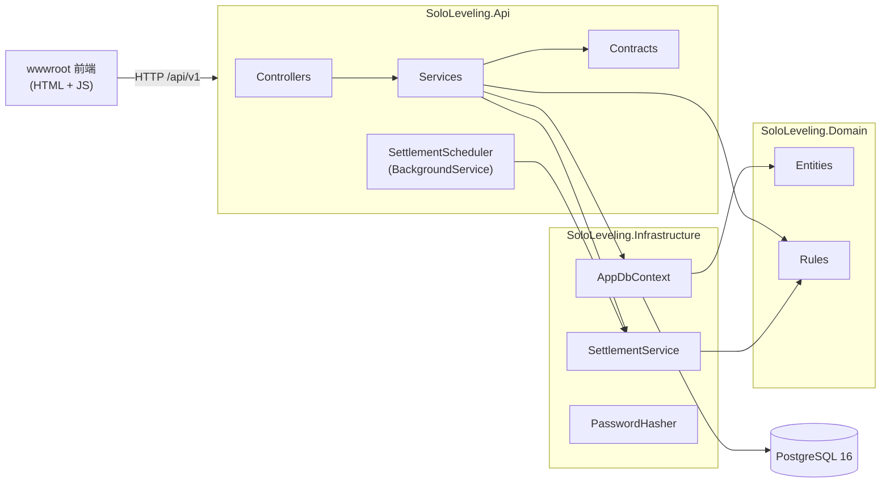

# SoloLeveling 架構說明

本文說明程式碼怎麼組織、一個請求怎麼流動、資料怎麼存。產品規則以 [SPEC.md](SPEC.md) 為準，啟動方式與環境變數見 [README.md](../README.md)。

## 1. 分層與依賴



- 專案參照：Api → Infrastructure → Domain，Domain 不參照任何框架套件。
- Domain 的規則全是 static 方法，只改記憶體中的實體並回傳要新增的資料（`XpEvent`、`DailyLog`），不碰 DB。
- 交易、列鎖、持久化都在 Infrastructure／Api；Api 服務層負責「開交易 → 結算 → 套規則 → 存檔 → commit」的編排。

## 2. 目錄與關鍵類別

### SoloLeveling.Domain

| 路徑 | 內容 |
| --- | --- |
| `Entities/User.cs` | 帳號：Email、PasswordHash、DisplayName、TimeZoneId（IANA） |
| `Entities/Player.cs` | 遊戲化狀態（以 UserId 為主鍵）：Level、Xp、五維屬性、HardMode、Streak、BestStreak、TotalCompleted、LastSettledDate；獎勵相關 PeakLevel、Coins、ShieldCount、ThemeKey、TitlePrefixKey／TitleSuffixKey、PinnedCardId；`AddStat` 增減屬性且最低 0 |
| `Entities/Program.cs` | 66 天週期：StartDate、Cycle、LengthDays（`DefaultLengthDays = 66`）、IsActive、CompletedAt（開新週期時週期已滿才寫入） |
| `Entities/Quest.cs` | 任務定義：StatType、Difficulty、QuestType、TargetValue、Step、Unit、SortOrder、IsArchived／ArchivedAt；漸進任務加 GoalId、ValueKind、StartValue、EndValue、StepValue、StageCount、DaysPerStep |
| `Entities/Goal.cs` | 目標：Category、Answers（JSON）、LengthDays、StartDate、IsArchived／ArchivedAt、CompletedAt；`Quests` 導覽集合 |
| `Entities/DailyLog.cs` | 某人某天的快照：CompletionRatio、IsCleared、BonusGranted、ClearCoinsGranted、Note、IsSettled／SettledAt、`Progresses` 導覽集合 |
| `Entities/QuestProgress.cs` | 某天某任務的進度：Value、IsDone、XpGranted、StatGranted、TargetSnapshot |
| `Entities/XpEvent.cs` | EXP 流水：Amount（可負）、Source、RefId、OccurredAt、Seq |
| `Enums.cs` | `StatType`、`Difficulty`、`QuestType`、`XpSource`、`GoalCategory`、`ProgressionValueKind`；獎勵：`Rarity`、`ChestSource`、`CoinSource`、`RewardEventKind`、`TitleSlot`、`QuestRole`、`ShopItem` |
| `DefaultQuests.cs` | 基本任務的 9 個樣板 |
| `Cards.cs`、`Achievements.cs` | 卡片目錄 `Cards.All`（25 張）；成就目錄 `Achievements.All`（12 個）與 `AchievementStats`（判定用統計快照） |
| `Themes.cs`、`Shop.cs` | 主題鍵（預設 azure）；商店價格與保險卡上限 3 |
| `Entities/RewardChest.cs` 等 | `RewardChest`、`OwnedCard`、`Achievement`、`OwnedTheme`、`CoinEvent`、`RewardEvent`；`Player` 加 PeakLevel、Coins、ShieldCount、ThemeKey、稱號字塊、PinnedCardId |
| `DomainValidationException.cs` | 規則層輸入不合法，API 對應 400 |
| `Goals/` | `GoalCategories`：四個類別定義；`GoalPlanner`：依回答產生任務樣板；`GoalCategoryDefinition` 與 `RoutineGoal`、`ExerciseGoal`、`ReadingGoal`、`ScreenTimeGoal` 實作 |
| `Rules/Leveling.cs` | `XpNeeded`、`GainXp`（連續升級）、`LoseXp`（撤銷，可降級）、`ApplyPenalty`（不降級）、`RankOf` |
| `Rules/CompletionRules.cs` | `IsDone`、`RewardOf`、`ThresholdOf`、`CompletionRatio`（四捨五入到 4 位）、`PenaltyOf`、`DailyBonusXp` 等常數 |
| `Rules/ProgressUpdater.cs` | `SetValue`（帶 `doneDaysBeforeToday` 計算 `EffectiveTarget`、寫進度＋發／收回任務獎勵、寫 `TargetSnapshot`）、`Recalculate`（重算達標率與達標獎勵）、`ClearQuestProgress`（改任務類型時清除今日進度） |
| `Rules/Settlement.cs` | `Settle`：結算演算法的純規則部分，回傳 `SettlementResult(Today, TodayLog, NewLogs, Events, ShieldsUsed)`；未達標日在連勝進行中且有保險卡時自動消耗；常數 `MaxCatchUpDays = 400`、`MaxPenaltiesPerSettlement = 3` |
| `Rules/TimeOfDay.cs` | `Parse(hh:mm)`、`Format(minutes)` 轉換時間編碼 |
| `Rules/Progression.cs` | `EffectiveTarget`、`RenderName`：計算漸進任務的目標與顯示名稱 |
| `Rules/UserClock.cs` | `DateOf(utc, timeZoneId)`：全專案唯一決定「今日」的地方 |
| `Rules/Rewards.cs` | `Evaluate(RewardInput) → RewardOutcome`：純函式判定寶箱、晉階、成就、達標金幣、保險卡；升級以 `PeakLevel` 判定 |
| `Rules/Loot.cs`、`Rules/Wallet.cs` | 開箱抽卡（亂數注入）；金幣異動的唯一入口，每次回傳 `CoinEvent` |
| `Rules/QuestRoles.cs`、`Rules/GoalCompletion.cs`、`Rules/Titles.cs` | 任務角色與分類連續天數；目標完成判定；稱號組合 |

### SoloLeveling.Infrastructure

| 路徑 | 內容 |
| --- | --- |
| `AppDbContext.cs` | DbSet、主鍵／唯一鍵／索引、欄位長度與精度、enum 存字串、`DateTimeOffset` ↔ Unix 毫秒的全域 converter |
| `SettlementService.cs` | `SettleAsync(userId, ct)`：`SELECT … FOR UPDATE` 鎖 Player 列、載入待結算區間的 DailyLog、呼叫 `Settlement.Settle`、存檔；呼叫端已有交易就沿用，沒有才自己開；把 `ShieldsUsed` 寫成未公告的 `RewardEvent` |
| `PasswordHasher.cs` | PBKDF2-SHA256 的 `Hash`／`Verify` |
| `Migrations/` | EF Core migration（`InitialCreate`、`AddGoalsAndProgression`、`AddRewards`） |

### SoloLeveling.Api

| 路徑 | 內容 |
| --- | --- |
| `Program.cs` | DI 註冊、Options 驗證、JWT、JSON converter、統一錯誤格式、啟動時 migrate、中介軟體順序 |
| `AppOptions.cs` | `DatabaseConnectionString`、`JwtSecret`（`[Required]`，JwtSecret `[MinLength(32)]`）；JWT 簽發與驗證都從這裡取金鑰 |
| `Controllers/AuthController.cs` | `POST /auth/register`（不再建任務）、`POST /auth/login`（不需驗證） |
| `Controllers/MeController.cs` | `GET /me`（加 `needsOnboarding`）、`PATCH /me`、`PUT /me/title`、`/me/pinned-card`、`/me/theme` |
| `Controllers/GoalsController.cs` | `GET /goals/categories`、`POST /goals/preview`、`POST /goals`、`GET /goals`、`DELETE /goals/{id}` |
| `Controllers/QuestsController.cs` | `GET/POST /quests`（加 `goalId`）、`PUT /quests/reorder`、`PUT/DELETE /quests/{id}`（漸進任務只允許改屬性） |
| `Controllers/TodayController.cs` | `GET /today`（任務加 `progression`）、`PUT /today/quests/{id}/progress`、`PUT /today/note` |
| `Controllers/HistoryController.cs` | `GET /history`、`GET /xp-events` |
| `Controllers/ProgramController.cs` | `POST /program/restart` |
| `Controllers/RewardsController.cs` | `GET /rewards`、`POST /rewards/chests/{id}/open`、`GET /cards`、`POST /shop/purchase` |
| `Services/TodayContextLoader.cs` | `LoadAsync`：先結算，再載入 User、Player、今日 DailyLog（含 Progresses）、未封存任務、漸進任務的 `DoneDaysBeforeToday`，回傳 `TodayContext` |
| `Services/AccountService.cs` | 註冊（建立 User、Player、第 1 週期；不再建任務）、登入、`ValidateTimeZone` |
| `Services/GoalService.cs` | 目標 CRUD；建立時驗證、產生任務、檢查重複；封存時連帶封存任務 |
| `Services/PlayerService.cs` | `/me` 查詢與更新（加 `needsOnboarding` = 無未封存任務）；切換困難模式時呼叫 `ProgressUpdater.Recalculate` |
| `Services/QuestService.cs` | 任務 CRUD 與排序；新增／修改／封存後重算今日達標；漸進任務禁止編輯目標欄位 |
| `Services/TodayService.cs` | 今日查詢、進度寫入、反思筆記；`Build` 組 `TodayResponse`（漸進任務加 `progression` 物件） |
| `Services/HistoryService.cs` | 每日紀錄（區間 ≤ 100 天）與 EXP 流水（limit 夾在 1–200） |
| `Services/ProgramService.cs` | 開新 66 天週期 |
| `Services/RewardApplier.cs` | `ApplyAsync(context, completedPrograms, ct)`：在第一次 SaveChanges 之後判定目標完成、查統計、`Rewards.Evaluate`、寫寶箱／成就／CoinEvent、回報保險卡事件，回傳 `RewardsDto` |
| `Services/RewardStatsLoader.cs` | 成就統計的批次查詢（最多 7 次，不隨任務數增加） |
| `Services/RewardService.cs` | 獎勵總覽、開箱、圖鑑、商店 |
| `Services/SettlementScheduler.cs` | `BackgroundService`，啟動時跑一次、之後每小時 `RunOnceAsync` |
| `Contracts/GoalDtos.cs` | Goal 與 progression 相關的 DTO |
| `Contracts/RewardDtos.cs` | 獎勵相關 DTO；`RewardsDto` 以選填 `Rewards` 參數掛在既有回應上（null 時 JSON 省略）；沒有其他內容的封存回應用 `RewardsEnvelope` |
| `Contracts/Dtos.cs`、`Contracts/TodayDtos.cs` | 請求／回應 record |
| `Contracts/Mappers.cs` | 實體轉 DTO（`ToDto`）、`ToUnixSeconds`（唯一的秒換算處）、`EffectiveTarget` 計算與名稱渲染 |
| `Contracts/StatTypeJsonConverter.cs` | `StatType` ↔ `STR/VIT/INT/WIL/SPI` |
| `Errors/ApiErrorException.cs` | 帶狀態碼與錯誤代碼的例外，含 `BadRequest／Unauthorized／NotFound／Conflict` 工廠方法 |
| `Errors/ErrorHandlingMiddleware.cs` | 把 `ApiErrorException`、`DomainValidationException` 轉成 `{ error: { code, message } }` |
| `Auth/JwtTokenService.cs` | 簽發 JWT |
| `Auth/CurrentUserExtensions.cs` | `User.GetUserId()` 取 `sub` claim |
| `wwwroot/` | `index.html`、`ui.js`、`hunter.js`（檔案頁、商店、主題）、`app.js`、`app.css`、`cards/`（卡片插畫，可缺） |

## 3. 請求生命週期：PUT /api/v1/today/quests/{id}/progress

1. **驗證與路由**：JwtBearer 驗 token，`TodayController.SetProgress` 以 `User.GetUserId()` 取得使用者 ID，把 `ProgressRequest.Value` 交給 `TodayService.SetProgressAsync`。
2. **開交易**：`db.Database.BeginTransactionAsync`。
3. **結算與載入**：`TodayContextLoader.LoadAsync` → `SettlementService.SettleAsync`：
   - 偵測到已有交易，不另開。
   - `SELECT * FROM "Players" WHERE "UserId" = … FOR UPDATE` 鎖住 Player 列；同一使用者的其他請求在此排隊。
   - 以 `UserClock.DateOf(now, user.TimeZoneId)` 算出今日，載入待結算區間到今日的 DailyLog。
   - `Settlement.Settle` 逐日結算到昨日，並確保今日的 DailyLog 存在；新紀錄與懲罰事件 `AddRange` 後 `SaveChangesAsync`（仍在交易內，不 commit）。
   - 對所有未封存的漸進任務，**一次批次查詢**「今天之前 `IsDone == true` 的天數」，做成 `IReadOnlyDictionary<Guid, int>` 放進 `TodayContext.DoneDaysBeforeToday`。
4. **載入今日內容**：loader 取 User、Player（已被追蹤的同一個實體）、今日 DailyLog 的 QuestProgress（EF 自動掛回 `Progresses`）、未封存任務（依 SortOrder）。
5. **找任務**：不在 `ActiveQuests` 裡就丟 `ApiErrorException.NotFound("QuestNotFound", …)`，交易隨 `await using` 釋放而回滾。
6. **套規則**：先記下既有進度的 Id，再呼叫 `ProgressUpdater.SetValue`（傳入 `context.DoneDaysBeforeToday` 以計算漸進任務的 `EffectiveTarget`）：
   - 驗證值（Check 只能 0／1，Count／Limit 不可為負，否則丟 `DomainValidationException`）；判定與完成率計算一律用 `Progression.EffectiveTarget` 而非 `quest.TargetValue`。
   - 沒有進度就新建 `QuestProgress` 並加入 `log.Progresses`；`SetValue` 寫入當天的 `TargetSnapshot`。
   - 依完成狀態變化發放或撤銷 EXP、屬性、TotalCompleted，產生 `Quest`／`QuestUndo` 事件。
   - `Recalculate` 重算達標率與 IsCleared，必要時產生 `DailyBonus`／`DailyBonusUndo` 事件，並更新 BestStreak。
7. **持久化**：把新進度明確 `db.QuestProgresses.AddRange`（避免被當成 Modified），事件 `db.XpEvents.AddRange`，`SaveChangesAsync`。
8. **套用獎勵**：`RewardApplier.ApplyAsync`（仍在交易內）：判定目標完成並寫 `CompletedAt` → `RewardStatsLoader` 批次查統計（此時看得到剛存的進度）→ `Rewards.Evaluate`（請求前快照 `TodayContext.Before` 只用來算 `levelsGained`）→ 寫寶箱、成就、`CoinEvent`（經 `Wallet`）、更新 `PeakLevel`／`ShieldCount`／`ClearCoinsGranted` → 未公告的保險卡事件標成已公告 → `SaveChangesAsync`。回傳的 `RewardsDto` 放進回應的 `rewards`。
9. **Commit**：`tx.CommitAsync`，釋放 Player 列鎖。
10. **組回應**：`Build(context)` 依未封存任務產生 `TodayQuestDto`（含 value、isDone、xpReward、statReward），加上今日的 completionRatio、isCleared、threshold、bonusGranted、note 與 `rewards`。

## 4. 結算

規則細節見 [SPEC.md 第 7 節](SPEC.md#7-結算演算法)，此處只列實作重點。

**觸發時機**

- 所有需要「今日」的端點：`GET/PATCH /me`、`PUT /me/*`、`POST/PUT/DELETE /quests`、`GET /today` 系列、`GET /history`、`POST /program/restart`、`GET /rewards`、`POST /rewards/chests/{id}/open`、`POST /shop/purchase`，都經 `TodayContextLoader.LoadAsync` 先結算。
- 不結算的端點：`GET /quests`、`PUT /quests/reorder`、`GET /xp-events`、`GET /cards`、auth。
- `SettlementScheduler`：啟動時跑一次、之後每小時一次；撈出所有使用者後在記憶體篩選 `LastSettledDate is null || LastSettledDate < 各自今日 - 1`，每人用獨立 scope 與交易呼叫 `SettleAsync`。單人失敗（`DbUpdateException`、`NpgsqlException`、`TimeoutException`）只記 log，不影響其他人。

**演算法重點（`Settlement.Settle`）**

- 起始日：`LastSettledDate + 1`；從未結算過則為 `Player.CreatedAt` 換成使用者時區的日期。
- 逐日處理 `[start, today)`，不含今日；缺席的日子補建 DailyLog（CompletionRatio 0）。
- 已 `IsSettled` 的日子跳過；未結算的用 DailyLog 現有 `CompletionRatio` 判定 IsCleared（不重算）。
- 達標 Streak + 1；未達標時若連勝進行中（Streak > 0）且有保險卡，消耗 1 張、Streak + 1 並回傳在 `ShieldsUsed`（`SettlementService` 寫成 `RewardEvent`），否則歸零；BestStreak 取最大值。保險卡由排程消耗時，下一次套用獎勵的請求回報一次。
- 困難模式未達標扣 `PenaltyOf(Level)`（`Leveling.ApplyPenalty`，不降級），同一次結算最多 3 天，事件 `RefId` 指向該日 DailyLog。
- 缺席超過 400 天：Streak 直接歸零，只逐日跑最近 400 天（`SettlementService` 的載入範圍也對應裁切）。
- `LastSettledDate` 只增不減：改時區往西使今日倒退時不會重跑已結算的日子。
- 最後確保今日 DailyLog 存在（IsSettled = false）。

**併發保證**

- 整段結算與後續修改在同一交易內，`FOR UPDATE` 讓同一使用者的第二個請求等第一個 commit 後才讀 Player，讀到的是已更新的 `LastSettledDate`，因此不會重複結算或重複懲罰（`SettlementServiceTests` 有併發測試）。

## 5. 資料模型

所有 table 與欄位名稱為 PascalCase（EF 預設，DbSet 名稱即 table 名稱）。主鍵皆為 `uuid`，Player 以 `UserId` 為主鍵。

| Table | 用途 | 主要約束／索引 |
| --- | --- | --- |
| `Users` | 帳號 | `Email` 為 `citext`，unique（大小寫不敏感）；`DisplayName` ≤ 40、`TimeZoneId` ≤ 64 |
| `Players` | 玩家狀態，與 User 一對一 | PK = FK `UserId` |
| `Programs` | 66 天週期 | partial unique index `UserId WHERE "IsActive" = true`（每人一筆進行中） |
| `Goals` | 漸進目標 | `Category` 存字串；`Answers` 為 jsonb；index `(UserId, IsArchived)`；partial unique index `(UserId, Category) WHERE "IsArchived" = false` |
| `Quests` | 任務定義 | index `(UserId, IsArchived)`；`Name` ≤ 60、`Unit` ≤ 10；`TargetValue`、`Step` 為 `numeric(10,2)`；漸進任務有 `GoalId`、`ValueKind`、`StartValue`、`EndValue`、`StepValue`、`StageCount`、`DaysPerStep`；階段不存 DB，由 `TodayContext.DoneDaysBeforeToday` 計算 |
| `DailyLogs` | 每日快照 | unique `(UserId, Date)`；`CompletionRatio` 為 `numeric(5,4)` |
| `QuestProgresses` | 某天某任務的進度 | unique `(DailyLogId, QuestId)`；`Value` 為 `numeric(10,2)`；`TargetSnapshot` 記錄當天判定用的 `EffectiveTarget` |
| `XpEvents` | EXP 流水 | index `(UserId, OccurredAt)`；`Seq` 為 `bigint GENERATED ALWAYS AS IDENTITY` |
| `RewardChests` | 寶箱 | index `(UserId, OpenedAt)`；`Rarity`、`Source` 存字串 |
| `OwnedCards` | 擁有的卡片 | PK `(UserId, CardId)` |
| `Achievements` | 已解鎖成就 | PK `(UserId, Key)`，擋重複解鎖 |
| `OwnedThemes` | 已購買主題 | PK `(UserId, ThemeKey)` |
| `CoinEvents` | 金幣流水 | index `(UserId, OccurredAt)`；`Seq` identity |
| `RewardEvents` | 保險卡生效等需通知的事件 | index `(UserId, AnnouncedAt)` |

- **enum**：`Quest.StatType／Difficulty／QuestType`、`XpEvent.Source`、`RewardChest.Rarity／Source`、`CoinEvent.Source`、`RewardEvent.Kind` 存字串。
- **時間戳**（`CreatedAt`、`ArchivedAt`、`SettledAt`、`OccurredAt`、`CompletedAt`、`OpenedAt`、`AnnouncedAt`、`UnlockedAt`、`FirstAcquiredAt`）：`bigint` Unix 毫秒，由 `AppDbContext.ConfigureConventions` 對所有 `DateTimeOffset`／`DateTimeOffset?` 屬性套用 converter；Domain 端一律是 `DateTimeOffset`。
- **日期**（`Program.StartDate`、`DailyLog.Date`、`Player.LastSettledDate`）：`date`，代表使用者時區下的日期。
- **XpEvent 排序**：`GET /xp-events` 依 `OccurredAt DESC, Seq DESC`。同一請求內的事件 `OccurredAt` 相同，`Seq` 只保證穩定排序。
- **擴充**：`citext` 由 migration 建立（`HasPostgresExtension("citext")`）。

## 6. 驗證流程

- **密碼**：`PasswordHasher` 使用 PBKDF2-SHA256、100,000 次、16 bytes salt、32 bytes hash，儲存格式 `pbkdf2-sha256$迭代次數$salt(Base64)$hash(Base64)`；驗證時讀字串內的迭代次數，日後調高不影響舊資料；比對用 `CryptographicOperations.FixedTimeEquals`。
- **簽發**：`JwtTokenService.CreateToken` 以 `JwtSecret` 做 HS256，有效 7 天，只放 `sub`（使用者 ID），不放 `nbf`。註冊與登入都回 `{ token, user }`。
- **驗證**：`Program.cs` 以 `AddOptions<JwtBearerOptions>(…).Configure<IOptions<AppOptions>>` 從 `AppOptions.JwtSecret` 取驗證金鑰（與簽發端共用同一個 Options 與 `ValidateOnStart`，不直接讀 `Configuration`），設 `MapInboundClaims = false`（claim 名稱保留 `sub`）、不驗 issuer／audience、`ClockSkew` 1 分鐘。
- **取使用者**：Controller 以 `[Authorize]` 保護，`CurrentUserExtensions.GetUserId()` 讀 `sub` 轉 Guid。
- **401 格式**：`JwtBearerEvents.OnChallenge` 改寫回應為 `{ error: { code: "Unauthorized", message } }`；登入帳密錯誤是 `AccountService` 丟 `ApiErrorException.Unauthorized("InvalidCredentials", …)`。

## 7. 前端

- 位置：`src/SoloLeveling.Api/wwwroot`（`index.html`、`app.css`、`ui.js`、`hunter.js`、`app.js`，另有 `cards/` 放卡片插畫，檔案可缺），由 `UseDefaultFiles`＋`UseStaticFiles` 提供。純 HTML＋JS，無建置步驟；`index.html` 依序載入 `ui.js`、`hunter.js`、`app.js`。
- **分工**：`ui.js` 以 `window.UI` 匯出共用元件（`h`、`win`、`statusPanel`、`sysMessage`、`toastError`、`confirmButton`、`setAccent`、`ApiError`），不呼叫 API、不處理路由；`hunter.js` 以 `window.Hunter` 匯出檔案頁（`render`）與設定頁的主題區塊（`themeSection`），呼叫端傳入 `api`；`app.js` 負責路由、API 呼叫與其餘畫面。
- **樣式與主題**：色碼只能寫在 `app.css` 的 `tokens:start`～`tokens:end` 區塊，其他地方一律用設計代號；`<html data-accent="azure|violet|jade">` 切換三套色票，預設 `azure`（`UI.setAccent(key)`）。字體由 Google Fonts 載入（Noto Serif TC／Noto Sans TC／IBM Plex Mono／Chakra Petch），皆有系統後備字。
- **快取**：`UseStaticFiles` 的 `OnPrepareResponse` 對所有靜態檔設 `Cache-Control: no-cache`，瀏覽器每次以 ETag 重新驗證（未變回 304），部署新版後不會拿到舊檔，因此不需要版本參數。
- **路由**：hash 路由 `#login`、`#register`、`#onboarding`、`#today`、`#progress`、`#hunter`、`#settings`，監聽 `hashchange`；無 token 時一律顯示登入／註冊。底部導覽由 `app.js` 的 `NAV_ITEMS` 產生；導向用 `go(hash)`（hash 已相同時直接重跑路由）；快速連續切換時只有最後一次路由會寫入畫面。
- **token**：存在 `localStorage` 的 `token`；API 回 401 時清除並導回 `#login`。
- **資料流**：每次切換畫面先並行取 `GET /me` 與 `GET /today`；勾選或輸入進度時呼叫 `PUT /today/quests/{id}/progress`，以回應覆蓋今日資料，再重取 `/me` 更新等級與屬性。同一時間只送一個進度請求，連點時忽略後續點擊。前端不計算 EXP、等級、達標率。
- **系統訊息**：成功與事件通知走 `UI.sysMessage`（排隊、3.2 秒或點擊關閉）。`api()` 把每個回應帶的 `rewards` 收進 `state.pendingRewards`，由 `announceRewards` 依序顯示一次：升級 → 晉階 → 寶箱 → 成就 → 保險卡生效（保險卡由排程消耗時，下一次請求帶回）。`announce(prevMe, prevToday, me, today, rewards)` 比對前後狀態宣告任務完成、今日達標、目標升階，最後接 `rewards` 的訊息（省略時取出 `state.pendingRewards`）；上一次看到的各漸進任務階段（連同等級）存在 `localStorage` 的 `seen:<userId>`，跨次開啟也能宣告目標升階；升級訊息只由 `rewards` 驅動。檔案頁的商店有保險卡與 E 級寶箱兩項，主題在設定頁購買與切換。
- **錯誤顯示**：`api()` 把錯誤回應與網路失敗轉成 `UI.ApiError`，由 `showError` 以紅色 toast 顯示 `error.message`；其他例外照常往上丟。

## 8. 容器化

- **Dockerfile（兩階段）**：
  - `sdk:10.0` 階段先只複製 `Directory.Build.props`、`SoloLeveling.slnx` 與三個 src 的 csproj 做 `restore`（利用層快取），再複製 `src/` 做 `publish -c Release`。
  - `aspnet:10.0` 執行階段額外安裝 `libgssapi-krb5-2`（Npgsql 啟動時會探測，缺少會在 log 印錯誤），`EXPOSE 8080`。
- **.dockerignore**：排除 `bin/`、`obj/`、`.vs/`、`.git/`、`tests/`、`docs/`、`*.md`、`**/appsettings.Development.json`（image 內不含開發設定；該檔仍留在 git 給 `dotnet run` 與 `dotnet ef` 使用）。
- **docker-compose.yml**：
  - `postgres`：`postgres:16-alpine`，資料庫 `sololeveling`，port 只綁 `127.0.0.1:5432`（預設帳密，不對外暴露），資料放 `pgdata` volume，healthcheck 用 `pg_isready`。
  - `api`：由根目錄 Dockerfile 建置，對外 8080，`depends_on` 等 postgres `service_healthy` 才啟動；環境變數 `ASPNETCORE_ENVIRONMENT=Production`、`DatabaseConnectionString`、`JwtSecret`（`${JwtSecret:?…}` 必填、無預設值，由根目錄 `.env` 或主機環境變數提供，範本見 `.env.example`；沒設時 compose 直接失敗）。
- **自動 migrate**：`Program.cs` 在 `app.Run()` 之前建立 scope 呼叫 `db.Database.Migrate()`。
- **健康檢查**：`GET /health` 由 `MapHealthChecks` 提供，`AddDbContextCheck<AppDbContext>` 會實際查一次資料庫；不需驗證，給 compose healthcheck 與部署後驗證用。
- **Swagger**：只在 `app.Environment.IsDevelopment()` 時註冊，compose 與正式環境都是 Production，不對外提供。
- **正式環境**：`deploy/docker-compose.prod.yml`（Caddy＋API＋PostgreSQL）、`deploy/Caddyfile`、`deploy/backup.sh`，操作步驟見 [DEPLOY.md](DEPLOY.md)。
- **設定驗證**：`AppOptions` 以 `ValidateDataAnnotations().ValidateOnStart()` 綁定，缺必填值啟動即失敗。

## 9. 新增一支需要「今日」的端點

照 `TodayService`／`QuestService` 的樣板：

1. **先寫失敗的整合測試**：在 `tests/SoloLeveling.Api.Tests` 的對應類別（加 `[Collection(PostgresCollection.Name)]`）用 `_factory.RegisterAsync()` 取得 client；需要跨日時用 `_factory.Clock.Advance(...)`。
2. **規則放 Domain**：若有新的 EXP／達標邏輯，在 `Rules/` 新增 static 方法，只改傳入的實體並回傳 `IReadOnlyList<XpEvent>`；輸入不合法丟 `DomainValidationException`。先在 `Domain.Tests` 補單元測試。
3. **服務方法**：
   ```csharp
   await using var tx = await db.Database.BeginTransactionAsync(ct);
   var context = await loader.LoadAsync(userId, ct);
   // 在 context.Player／context.TodayLog／context.ActiveQuests 上套規則
   db.XpEvents.AddRange(events);
   // 透過導覽集合新增的實體要明確 AddRange
   await db.SaveChangesAsync(ct);
   // 會改玩家狀態的端點一律套用獎勵（存檔之後，統計才看得到本次修改），結果放進回應的 Rewards
   var rewards = await rewardApplier.ApplyAsync(context, 0, ct);
   await tx.CommitAsync(ct);
   ```
   - 時間一律 `clock.GetUtcNow()`（注入的 `TimeProvider`），今日用 `context.Today`，不要自己算。
   - 找不到資源丟 `ApiErrorException.NotFound(...)`，其他錯誤用對應的工廠方法。
4. **DTO**：在 `Contracts/` 新增 record；實體轉 DTO 放 `Mappers`，時間戳用 `ToUnixSeconds()`。
5. **Controller**：加 `[Authorize]`，以 `User.GetUserId()` 取 ID，標上 `ProducesResponseType`（錯誤回應型別為 `ErrorResponse`），並補 XML 註解。
6. **註冊 DI**：新服務在 `Program.cs` 以 `AddScoped` 註冊。
7. **收尾**：`dotnet build`（警告即錯誤）、`dotnet test`、`dotnet format --verify-no-changes`；若改了實體對應，新增 migration。
